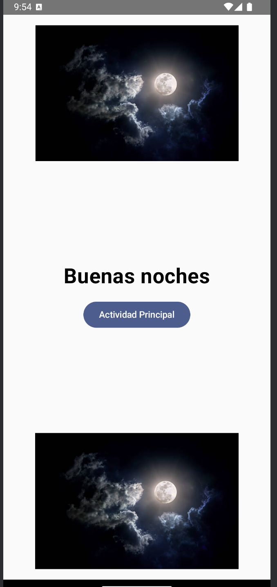
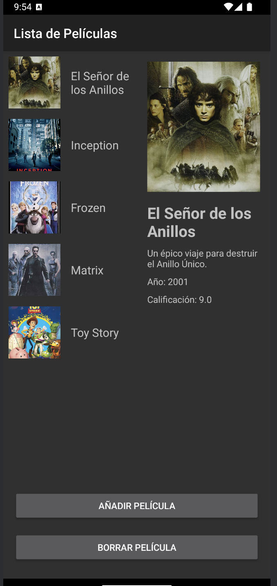
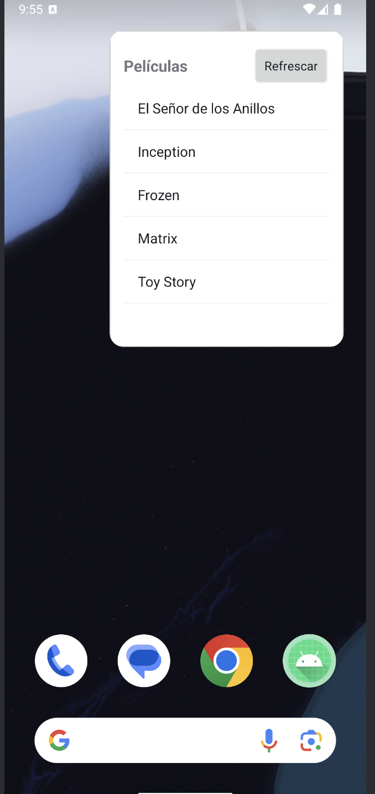

# Taller 4

Este repositorio contiene el código fuente de la aplicación Taller 4. La aplicación está diseñada para gestionar una lista de películas, permitiendo a los usuarios agregar, ver y eliminar películas. También incluye un widget para mostrar la lista de títulos de películas y cambia el color de fondo según el movimiento del dispositivo.

## Repositorio

El repositorio para este proyecto se puede encontrar en: [https://github.com/jmartter/Taller_4.git](https://github.com/jmartter/Taller_4.git)

## Componentes de la Aplicación

La aplicación está compuesta por los siguientes componentes principales:

1. **MainActivity**: La actividad principal que aloja los fragmentos y maneja los eventos del sensor para cambiar el color de fondo según el movimiento del dispositivo.
2. **Pantalla de Inicio**:
   - **ActividadPrincipalScreen**: Una pantalla de bienvenida que muestra un saludo basado en la hora del día y un botón para navegar a la actividad principal.
3. **Fragmentos**:
   - **ListaPeliculasFragment**: Muestra la lista de películas.
   - **DetallesPeliculaFragment**: Muestra los detalles de una película seleccionada.
   - **GestionPeliculasFragment**: Gestiona la adición y eliminación de películas.
4. **PeliculaRepository**: Gestiona la lista de películas y maneja la adición, eliminación y recuperación de películas.
5. **PeliculasAdapter**: Un adaptador para mostrar la lista de películas en un RecyclerView.
6. **Widget**:
   - **PeliculasWidgetProvider**: El AppWidgetProvider para el widget de la lista de películas.
   - **PeliculasWidgetService**: El servicio que proporciona datos al widget.
   - **PeliculasRemoteViewsFactory**: La fábrica que crea RemoteViews para el widget.

## Funcionalidades

- **Agregar Película**: Los usuarios pueden agregar una nueva película a la lista. La aplicación verifica títulos duplicados y calificaciones válidas (0-10).
- **Ver Detalles de la Película**: Los usuarios pueden ver los detalles de una película seleccionada.
- **Eliminar Película**: Los usuarios pueden eliminar una película seleccionada de la lista.
- **Widget**: Un widget que muestra la lista de títulos de películas.
- **Cambio de Color de Fondo**: El color de fondo de la actividad principal cambia según el movimiento del dispositivo.

## Capturas de Pantalla

### Pantalla Principal con Saludo, Lista de Películas con Fragmentos y Widget

    
    
    

## Cómo Funciona

1. **MainActivity**: Inicializa los fragmentos y registra un listener de sensor para detectar el movimiento del dispositivo y cambiar el color de fondo.
2. **Pantalla de Inicio**: Muestra un saludo basado en la hora del día y un botón para navegar a la actividad principal.
3. **ListaPeliculasFragment**: Muestra la lista de películas usando un RecyclerView y PeliculasAdapter.
4. **DetallesPeliculaFragment**: Muestra los detalles de una película seleccionada.
5. **GestionPeliculasFragment**: Proporciona un diálogo para agregar una nueva película y maneja la eliminación de películas.
6. **PeliculaRepository**: Gestiona la lista de películas y asegura que no haya títulos duplicados y calificaciones válidas.
7. **Widget**: Muestra la lista de títulos de películas y se actualiza cuando cambia la lista de películas.

